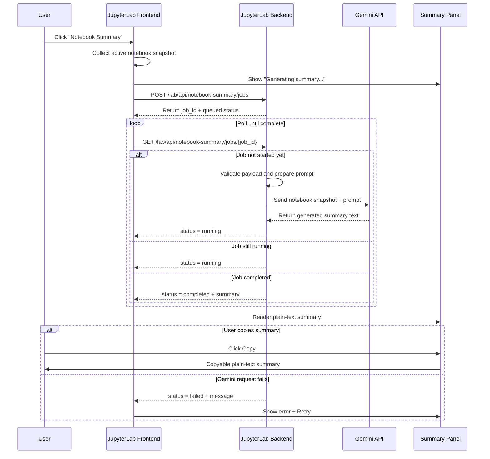

# Notebook Summary Feature Spec

## Overview

The current implementation in `packages\extensionmanager-extension\src\index.ts` adds a **Notebook Summary** button to a left-side panel. Clicking the button currently opens a placeholder dialog with **"Summary coming soon!"**.

This spec defines how to turn that placeholder into a working notebook summarization feature that:

1. Opens the summary panel when the user clicks **Notebook Summary**
2. Starts a **background** summary job for the currently active notebook
3. Uses **Google Gemini** server-side to generate a summary of the notebook contents
4. Displays the summary in the panel
5. Makes the summary easy to **select, copy, and paste**

This is a product and implementation spec only. It does **not** require code changes yet.

## Goals

- Generate a useful summary of the **currently active notebook**
- Include the notebook's meaningful content:
  - markdown cells
  - code cells
  - execution outputs
  - errors / tracebacks
  - basic notebook metadata when helpful
- Run summarization asynchronously so the UI stays responsive
- Keep Gemini credentials and provider calls on the **server**, not in the browser
- Make the resulting summary readable, refreshable, and copyable

## Non-Goals

- Full notebook chat / agent workflows
- Inline cell-by-cell annotations in v1
- Editing notebook content from the summary panel
- Long-term summary history across sessions in v1
- Exposing Gemini API keys to the frontend

## Current State

Current entry point:

- `packages\extensionmanager-extension\src\index.ts`

Current behavior:

- A `SummaryPanel` widget is created in the left area
- The panel contains a button labeled **Notebook Summary**
- Clicking the button triggers a placeholder dialog

This means the UI hook already exists, but there is currently:

- no notebook data collection
- no summary service
- no backend API
- no job lifecycle
- no summary display state

## Desired User Experience

### Primary flow

1. User opens or focuses a notebook.
2. User clicks **Notebook Summary** in the summary panel.
3. The panel switches into a loading state such as:
   - "Generating summary..."
   - spinner / progress indicator
4. JupyterLab gathers the current notebook snapshot, including unsaved in-memory edits.
5. A background request is started on the server.
6. When the job completes, the panel shows a plain-text summary.
7. The user can:
   - select the text directly
   - use a **Copy** button
   - regenerate the summary with **Refresh**

### Empty / invalid states

- If no notebook is active, show: **"Open a notebook to generate a summary."**
- If a summary job is already running, disable duplicate submits and show current progress
- If the notebook is too large, show a clear message and optionally fall back to chunked summarization
- If Gemini fails, show an actionable error with **Retry**

## Direct Gemini API Flow

The v1 implementation should call the **Gemini API directly from the JupyterLab backend**. The browser does not talk to Gemini itself, and this flow does not require an MCP server.



## Recommended v1 Output Format

The summary should be returned and displayed as **plain text**, not rendered HTML. This keeps copy/paste simple and avoids sanitization and formatting issues.

Recommended structure:

```text
Notebook Summary

Overview
- ...

Main Topics
- ...

Important Results
- ...

Code and Analysis Highlights
- ...

Warnings / Errors
- ...

Suggested Next Steps
- ...
```

The exact phrasing can be prompt-controlled, but the displayed result should remain plain text.

## Functional Requirements

### 1. Notebook selection

- The feature must summarize the **currently active notebook**
- The implementation should use `INotebookTracker` to identify the active `NotebookPanel`
- The summary request must reflect the notebook's current in-memory state, not only the last saved file on disk

### 2. Notebook content extraction

The frontend should build a normalized notebook snapshot containing:

- notebook path / name
- kernel name if available
- cell order
- cell type
- cell source
- execution count when available
- outputs for code cells
- error outputs / tracebacks
- selected metadata fields only when useful

Recommended normalization rules:

- Preserve cell order
- Keep markdown as raw markdown text
- Keep code as raw source text
- Convert outputs to text where possible
- Include tables / structured outputs as text or JSON snippets
- Avoid shipping large binary blobs directly unless a later multimodal path is added

### 3. Background execution

Summary generation must run asynchronously relative to the UI.

Recommended model:

- Frontend creates a summary job with `POST /lab/api/notebook-summary/jobs`
- Server returns `job_id` immediately
- Frontend polls `GET /lab/api/notebook-summary/jobs/{job_id}`
- Optional: support `DELETE /lab/api/notebook-summary/jobs/{job_id}` for cancellation

This is simpler and lower-risk than introducing a websocket-only path in v1.

### 4. Gemini integration

Gemini must be called from the server layer only.

Server responsibilities:

- read Gemini credentials from environment variables or Jupyter config
- construct the LLM request
- handle timeouts, provider errors, and rate limits
- return normalized summary text to the frontend

Why server-side:

- avoids exposing secrets in browser code
- allows audit/logging controls
- enables retries, size limits, and provider abstraction

### 5. Summary display and copy/paste

The panel should display:

- current notebook name
- job status
- generated summary text
- `Copy` button
- `Refresh` button

Copy behavior:

- primary: explicit **Copy** button using the existing JupyterLab clipboard utilities
- secondary: raw text remains directly selectable for manual copy

## Proposed Architecture

## Frontend

### Main responsibilities

- detect active notebook
- collect notebook content
- send a summary job request
- manage loading / success / error states
- render summary text
- support copy and refresh

### Likely frontend touchpoints

- `packages\extensionmanager-extension\src\index.ts`
  - replace placeholder dialog behavior
  - inject notebook tracking dependency
  - wire button -> summary workflow
- new summary UI state module or widget in the same package
  - recommended instead of growing `index.ts` further

### Frontend state model

Suggested panel states:

- `idle`
- `noNotebook`
- `submitting`
- `running`
- `success`
- `error`

Suggested state fields:

- active notebook id/path
- last summarized notebook id/path
- current job id
- summary text
- error message
- requested_at / completed_at

## Backend

### Main responsibilities

- receive notebook snapshot payload
- validate and normalize request size/content
- create async summary job
- call Gemini
- return final plain-text summary

### Likely backend touchpoints

- new handler, for example:
  - `jupyterlab\handlers\notebook_summary_handler.py`
- handler registration in:
  - `jupyterlab\labapp.py`

### Suggested API shape

#### Create job

`POST /lab/api/notebook-summary/jobs`

Request body:

```json
{
  "notebook": {
    "path": "path/to/notebook.ipynb",
    "name": "notebook.ipynb",
    "kernel": "python3",
    "cells": [
      {
        "index": 0,
        "cell_type": "markdown",
        "source": "# Title"
      },
      {
        "index": 1,
        "cell_type": "code",
        "source": "print('hello')",
        "execution_count": 1,
        "outputs": [
          {
            "output_type": "stream",
            "name": "stdout",
            "text": "hello"
          }
        ]
      }
    ]
  }
}
```

Response:

```json
{
  "job_id": "abc123",
  "status": "queued"
}
```

#### Poll job

`GET /lab/api/notebook-summary/jobs/{job_id}`

Response while running:

```json
{
  "job_id": "abc123",
  "status": "running"
}
```

Response on success:

```json
{
  "job_id": "abc123",
  "status": "completed",
  "summary": "Notebook Summary\n\nOverview\n- ..."
}
```

Response on failure:

```json
{
  "job_id": "abc123",
  "status": "failed",
  "message": "Gemini request timed out"
}
```

## Prompting Strategy

The prompt should tell Gemini to summarize the notebook as an analysis artifact, not as a generic document.

Recommended prompt requirements:

- identify the notebook's main purpose
- summarize key markdown explanations
- summarize important code sections
- summarize significant outputs / results
- call out failures, warnings, or incomplete execution
- produce concise, plain-text output
- avoid hallucinating results not present in the notebook

Recommended prompt guardrails:

- "Only summarize information present in the notebook snapshot."
- "If execution results are missing or inconsistent, say so explicitly."
- "Return plain text only."

## Large Notebook Strategy

Large notebooks are the highest implementation risk.

Recommended v1 approach:

1. Serialize the full notebook snapshot
2. Measure payload size before submission
3. If under threshold, send directly
4. If over threshold, chunk the notebook by cell ranges
5. Summarize chunks first, then summarize the chunk summaries

This keeps the feature usable without depending on a single oversized prompt.

Recommended rules:

- hard request size cap to protect the server
- truncation rules for extremely large outputs
- preserve a note in the final prompt when truncation occurred

## Security and Privacy

Because notebook contents may include sensitive data, this feature needs explicit safeguards.

Required safeguards:

- Gemini API credentials stored server-side only
- authenticated JupyterLab API handler
- no provider secrets in browser bundles
- configurable opt-out / disable switch
- clear logging that avoids dumping raw notebook contents

Recommended configuration:

- environment variable or traitlets config for Gemini credentials
- configurable request timeout
- configurable max notebook payload size
- configurable enable/disable flag for notebook summary feature

## Error Handling

The UI should expose distinct, user-friendly failures:

- no active notebook
- notebook extraction failed
- request rejected because notebook is too large
- summary job timed out
- Gemini credentials missing
- Gemini rate-limited or unavailable
- server error

Recommended UX:

- show a short friendly error in-panel
- keep technical detail available for logs
- preserve the last successful summary until a new one succeeds

## Accessibility

The final panel must remain accessible.

Requirements:

- keyboard-accessible generate / refresh / copy buttons
- loading and error states announced appropriately
- summary region labeled for screen readers
- copy action should produce an explicit success or failure affordance

## Testing Plan

### Frontend tests

- panel shows empty state when no notebook is active
- clicking summary starts a job
- loading, success, and error states render correctly
- copy button copies the returned summary text
- refresh starts a new job and replaces the previous result

### Backend tests

- authenticated job creation works
- invalid payloads are rejected
- oversized payloads are rejected or chunked per config
- Gemini provider failures propagate as useful API errors
- completed jobs return plain-text summaries

### Integration / E2E tests

- open notebook -> click summary -> see generated summary
- summary remains copyable
- failed provider call shows retryable error

For test reliability, Gemini should be mocked in automated tests.

## Recommended Implementation Breakdown

### Phase 1: Replace placeholder behavior

- replace dialog-only flow with a real summary panel state machine
- inject active notebook tracking
- render loading / result / error states

### Phase 2: Add backend API

- add notebook summary handler
- register new routes in `jupyterlab\labapp.py`
- support async job creation and polling

### Phase 3: Add Gemini provider integration

- add server-side provider wrapper
- add configuration and credential loading
- define prompt template and output contract

### Phase 4: Handle scale and robustness

- add payload caps
- add chunked summarization for large notebooks
- add retries / timeout behavior where appropriate

### Phase 5: Harden UX

- copy button
- refresh behavior
- better empty/error messaging
- accessibility polish

## Open Questions

These should be resolved before implementation starts:

1. Should v1 include image outputs through Gemini multimodal input, or treat image outputs as omitted / described metadata only?
2. Should summaries auto-refresh when notebook content changes, or only on explicit user action?
3. Should summaries be cached per notebook revision to reduce repeated provider calls?
4. Should the summary be plain text only, or also optionally rendered as markdown while preserving a copyable raw-text view?
5. What Gemini product path is intended: direct Gemini API, Vertex AI, or an internal proxy service?

## Recommendation

For v1, the safest path is:

- keep the existing panel entry point
- use `INotebookTracker` to capture the active notebook
- send a normalized notebook snapshot to a new authenticated JupyterLab backend API
- call Gemini on the server
- poll job status from the frontend
- render the result as plain text with a dedicated **Copy** button

That delivers the requested user-facing behavior with the lowest security risk and the clearest path to iterative improvement.
